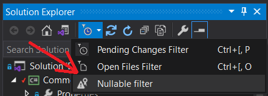

# Nullable Solution Filter for Visual Studio Solution Explorer

This extension adds a custom filter for Solution Explorer. With this filter, all files/csprojes with a NRE feature on will be hided, and only items that you need to switch to NRE on will be showed.

This extension need to read all your files/csprojes from the disk, so applying the filter to the big solution may take a while, please remember it.

If a csproj somehow have a multiple nodes `Nullable` then this csproj is considered as NRE disabled and will be visible all the time. If a cs file have both nodes `#nullable enable` and `#nullable disable` then this file is considered as suspicious, and will be visible all the time. File NRE status overrides the project NRE status, as usual. This extension does not take into account the exact place of `#nullable` directive in the file.

Only C# supported. But CPS and legacy project system supported. I suppose there will be a problems if your solutions contains a shared project `shproj`.

